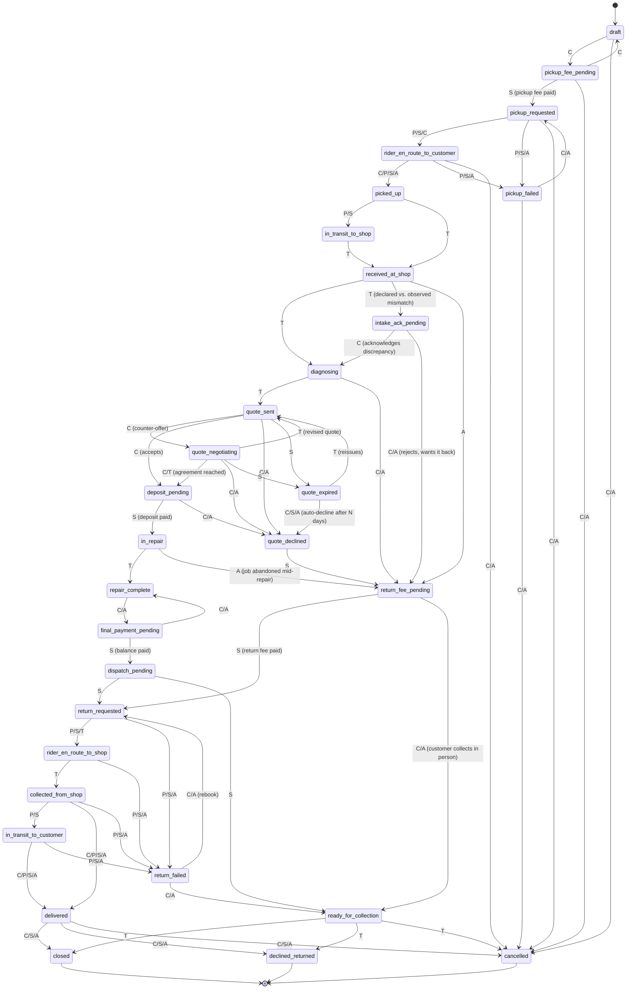

# Job state machine

`lib/core/state-machine.ts` is the single source of truth: `npm run gen:state-machine` regenerates the `job_status`
enum and the `job_transitions` table in `db/migrations/0002_state_machine.sql` from it, and
`tests/unit/state-machine.test.ts` fails the build if the generated SQL ever drifts from the TypeScript. The
database itself rejects any transition not listed here (`transition_job()`, a `SECURITY DEFINER` function — see
`db/migrations/0005_functions.sql`), so this diagram is not just documentation, it's enforced twice over.

## Actors

| Letter | Actor | Notes |
| --- | --- | --- |
| C | customer | |
| T | technician | |
| A | shop_admin | inherits every edge `T` may take, plus its own |
| — | platform_admin | inherits every edge `A` may take (support-mode impersonation only) |
| S | system | the worker/outbox, or a DB trigger, acting on its own |
| P | provider | a courier webhook (TumaBoda/mock) reporting delivery status |

## Diagram

## Terminal states and their required outcome

A job entering a terminal state must carry a matching `outcome` column value (enforced in `transition_job()`):

| Terminal state | Required outcome |
| --- | --- |
| `closed` | `repaired` |
| `cancelled` | `cancelled` |
| `declined_returned` | `declined` |

## Timers

Timers are scheduled by `schedule_timer()` on entry to a state and cancelled automatically on exit (so a job that
moves on before a timer fires never gets a stale reminder). `TIMER_ALIVE_IN` (`lib/core/state-machine.ts`) is the
source of truth:

| Timer | Alive while the job is in | Effect when it fires |
| --- | --- | --- |
| `quote_expiry` | `quote_sent`, `quote_negotiating` | `quote_expired` (after `tenant_settings.quote_expiry_hours`) |
| `expired_quote_autodecline` | `quote_expired` | `quote_declined` (after `expired_quote_autodecline_days`) |
| `deposit_reminder` | `deposit_pending` | a nudge notification, no transition |
| `final_payment_reminder` | `final_payment_pending` | a nudge notification, no transition |
| `dropoff_reminder` | `repair_complete` | a nudge notification, no transition |
| `unclaimed_alert` | `repair_complete`, `ready_for_collection`, `return_failed` | alerts shop_admin (`unclaimed_after_days`) |
| `auto_close` | `delivered` | `closed` (after `tenant_settings.auto_close_hours`), outcome `repaired` |

## Board and customer-facing groupings

Two different groupings of the same 30 states drive the UI, both also defined in `lib/core/state-machine.ts` so
they can never disagree with what `canTransition()` actually allows:

- `BOARD_COLUMNS` — the technician bench board's five columns (Incoming, At bench, Awaiting customer, Ready to
  dispatch, Out for delivery).
- `CUSTOMER_STEPS` — the seven-step progress header a customer sees on their own job page (Booked, Pickup,
  Diagnosis, Quote, Repair, Return, Done), deliberately coarser than the raw state names.

## Changing the state machine

1. Edit `TRANSITIONS` (and `TIMER_ALIVE_IN` / `BOARD_COLUMNS` / `CUSTOMER_STEPS` if relevant) in
   `lib/core/state-machine.ts`.
2. `npm run gen:state-machine` to regenerate `db/migrations/0002_state_machine.sql`. Never hand-edit that file.
3. Update this diagram to match — nothing enforces the diagram staying in sync, only the SQL.
4. Add or update a test in `tests/db/transitions.test.ts` for any new edge, per the brief's "every state transition
   needs a test" rule.
